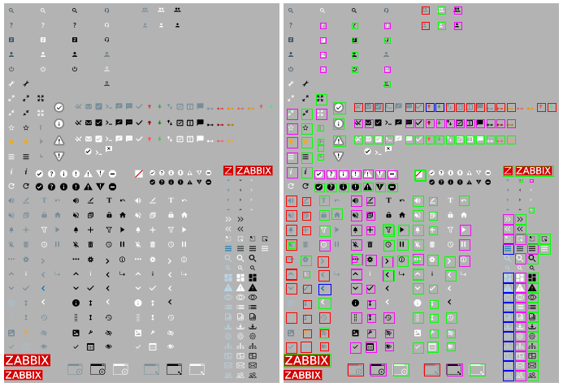
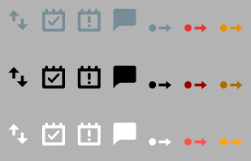
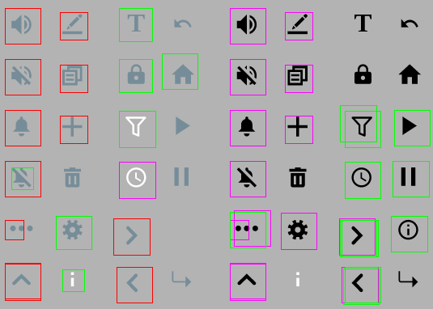
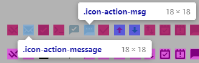
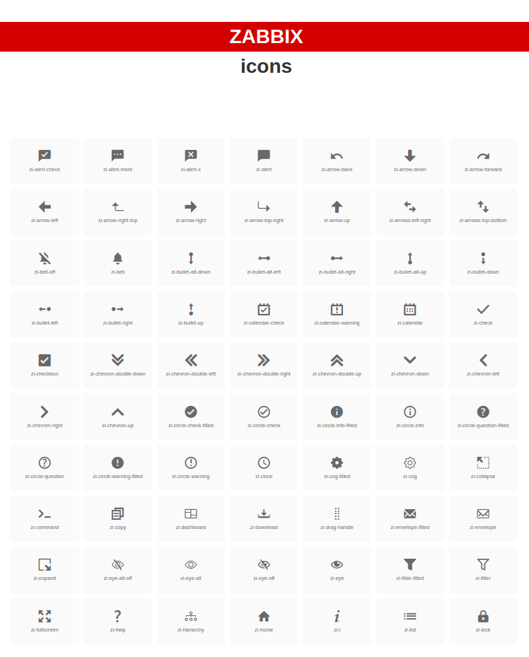

# Zabbix UI icon set

Having a sprite file is not a terrible idea in general, but it has its set of problems.
- Different icon colors or icon sizes create duplicates in the sprite file: 

- Sprite file becomes a junkyard of icons because of the lack of grids: 

- Many icons are referenced multiple times with different names. This makes really hard to find the right icon in a set: 

## Icon font

To mitigate the problems of the sprite files it was decided to create an icon font that could be used across the Zabbix Frontend.  

## Build process

- Execute `npm install` to initialize the project.
- Add icons into the `svg` directory (if needed).
*Existing icons have the* **4.8mm x 4.8mm** *max size and are centered into a* **6mm x 6mm** *image.*
- Execute `npm run generate` to create icon font.
- Execute `npm run cleanup` to remove extra files created by the generation process.

That's it! Now `dist` directory contains all the required files including the `index.html` file with the icon list demo.
