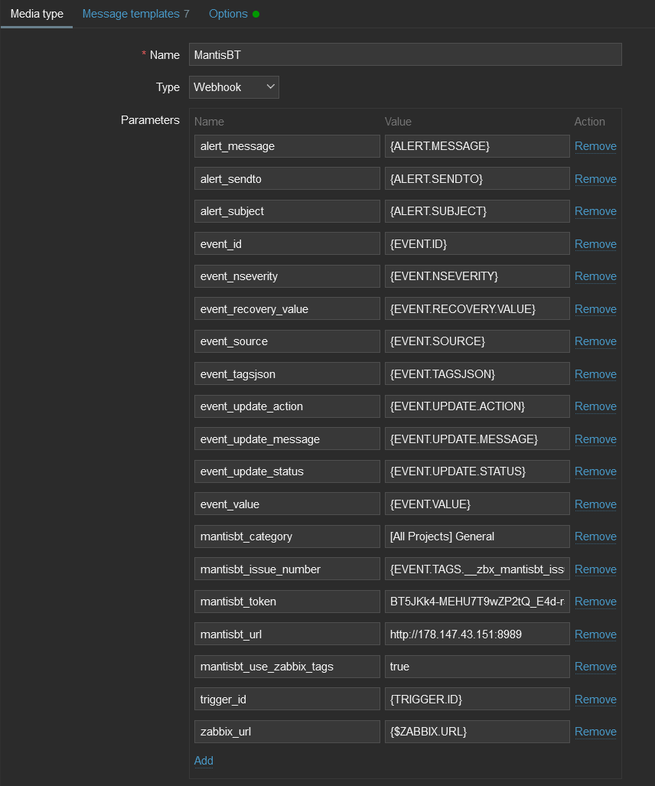

# Mantis Bug Tracker webhook

This guide describes how to integrate your Zabbix installation with Mantis BT issues using the Zabbix webhook feature. This guide will provide instructions on setting up a media type, a user and an action in Zabbix.
  

## In Mantis BT

1\. Create or use existing **project** for creating issues.

2\. Create or use existing user in Mantis BT with permission to create issues in desired project. You may like to check [instruction](https://support.mantishub.com/hc/en-us/articles/203574829-Creating-User-Accounts) how to di it.

3\. Create a **access token** according to the original [instruction](https://support.mantishub.com/hc/en-us/articles/215787323-Connecting-to-MantisHub-APIs-using-API-Tokens).

4\. Copy the **access token** to use it in Zabbix.
  

## In Zabbix

The configuration consists of a _media type_ in Zabbix, which will invoke the webhook to send alerts to Mantis BT issues through the [Mantis BT Rest API](https://www.mantisbt.org/docs/master/en-US/Developers_Guide/html/restapi.html).

1\. [Import](https://www.zabbix.com/documentation/6.0/manual/web_interface/frontend_sections/administration/mediatypes) the Mantis BT media type from file [media_mantisbt.yaml](media_mantisbt.yaml).

2\. Change in the imported media the values of the next variables:

- mantisbt_category - Category with witch issues will be created. Default value: "[All Projects] General"
- mantisbt_token - Mantis BT **access token**
- mantisbt_url - Mantis BT url address
- mantisbt_use_zabbix_tags - true|false if you like or not to attache zabbix tags to issues. Default value: "true"

3\. Create user and add MantisBT media type to it. In field "Send to" use your Mantis BT project name.

4\. Set up a global macro {$ZABBIX.URL} with URL of current zabbix. Please notice that HTTPS will be used by default if HTTP/HTTPS schema is not present in the URL.

For more information, please see [Zabbix](https://www.zabbix.com/documentation/6.0/manual/config/notifications) and [Mantis BT](https://www.mantisbt.org/documentation.php) documentation.
  

## Supported Versions

Zabbix 6.0, Mantis BT 2.22
