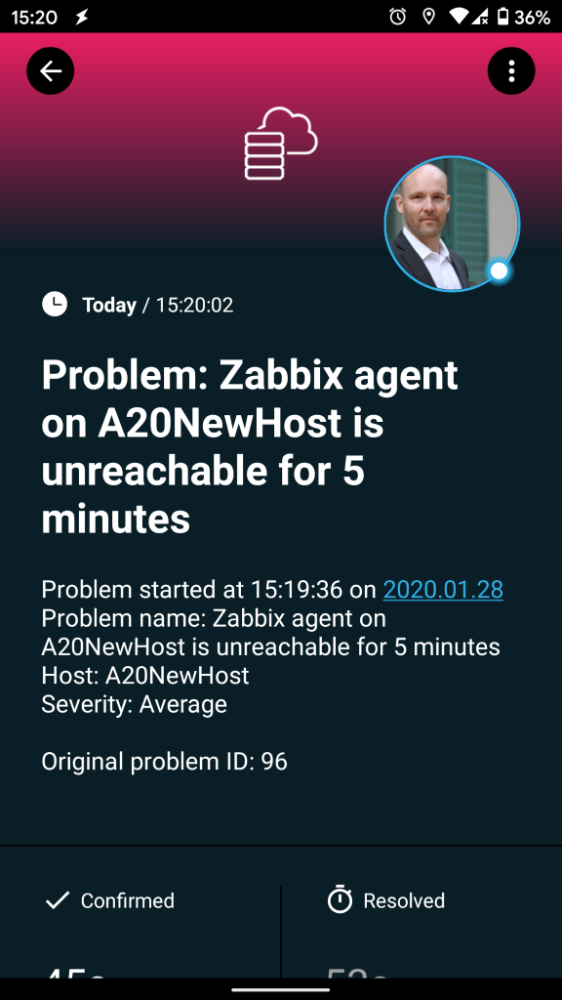
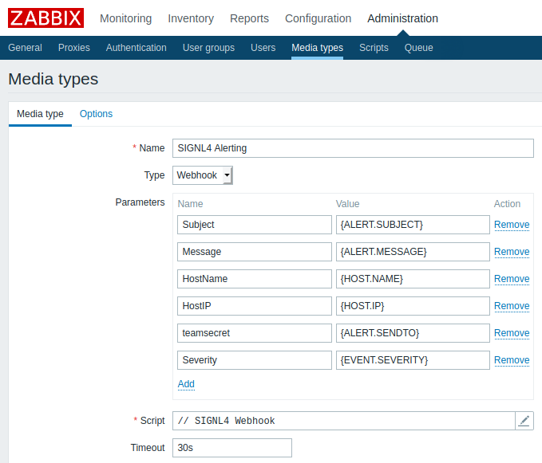
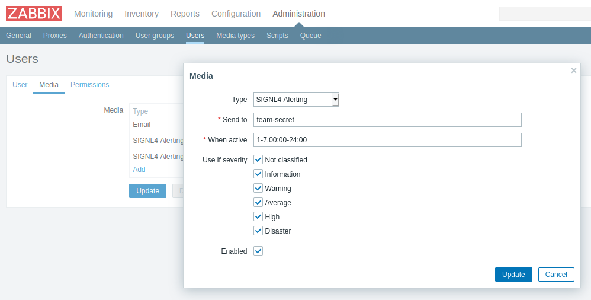
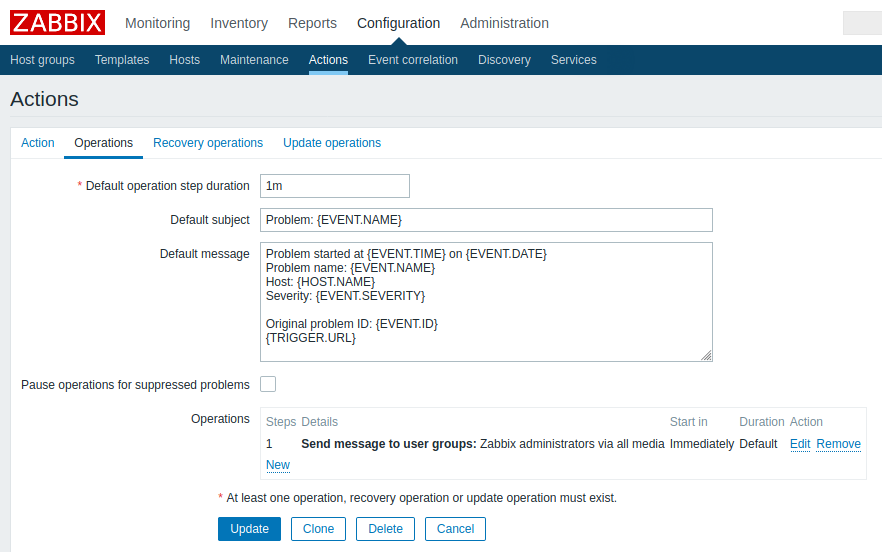

# SIGNL4 Integration for Zabbix

## Why SIGNL4

SIGNL4 is a mobile alert notification app for powerful alerting, alert management and mobile assignment of work items. It offers alerting via app push, SMS and voice calls including escalations, tracking, and duty scheduling.

Get the app at https://www.signl4.com.

Pairing Zabbix with SIGNL4 can enhance your daily operations with an extension to your team wherever it is.

## Setup

There are two options to integrate SIGNL4 with Zabbix.

1. Webhook  
If you use Zabbix 4.4 or higher the webhook is the recommended option.

2. Script  
If you are using a Zabbix version lower than 4.4 you the script integration is for you.

## Webhook Integraion

In the following we describe the setup and configuration of the SIGNL4 webhook for Zabbix:

1. Get SIGNL4  
If not already done, sign up for your SIGNL4 account at https://www.signl4.com or directly from within your SIGNL4 app you can download from the Play Store or App Store.

2. Get the Webhook XML  
Get the XML file (zabbix-signl4.xml) for Zabbix from GitHub (https://github.com/signl4/signl4-integration-zabbix).

3. Import the Media Type  
In Zabbix you can now impart a new Media Type under Administration -> Media types -> Import. Select the file zabbix-signl4.xml here.

The parameter teamsecret is filled from the user's Sent to field. The other parameters are flexible and you can add, remove or adapt them as needed.

4. Add Media Type to User  
Under Administration -> Users, create a dedicated user and add the media type we have created above.
Sent to: This is the team secret of your SIGNL4 team. This is the last part of your webhook URL: https://connect.signl4.com/webhook/<team-secret>.

Please note that this user represents your SIGNL4 team, so it is more a team than a single user in this case.

5. Create an Action  
Under Configuration -> Actions you can create an Action that will send the notification to the SIGNL4 user.

6. Test it  
Now you can trigger a problem that will call the above action to then send the alert notification to your SIGNL4 user.

You can find the package on GitHub:
https://github.com/signl4/signl4-integration-zabbix
